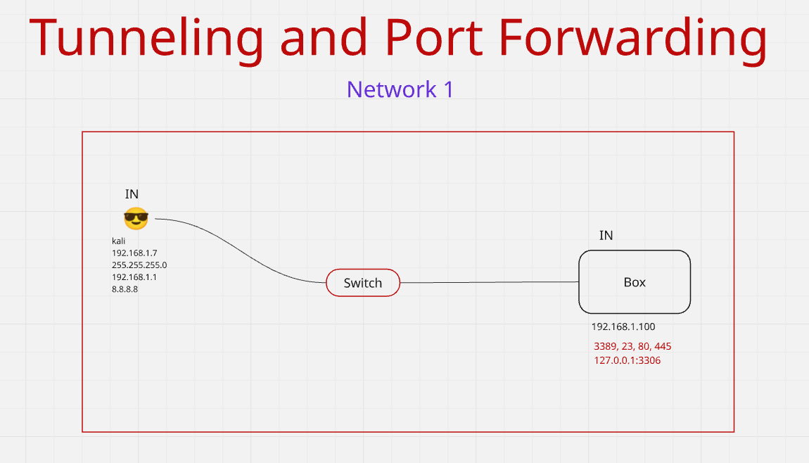
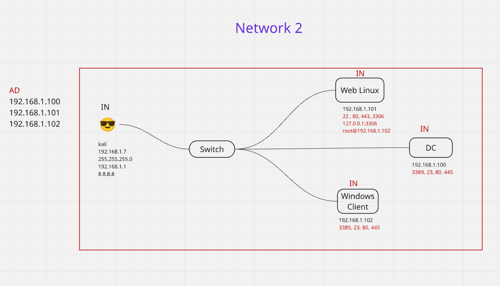
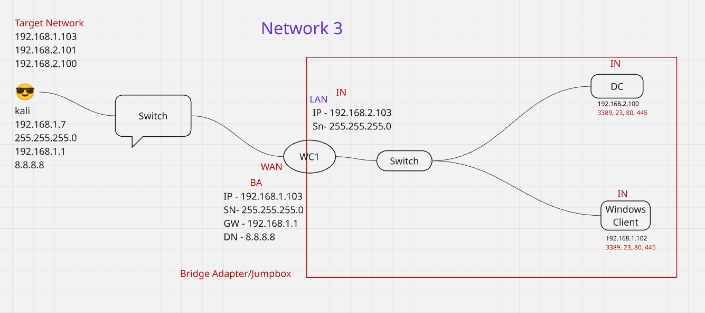
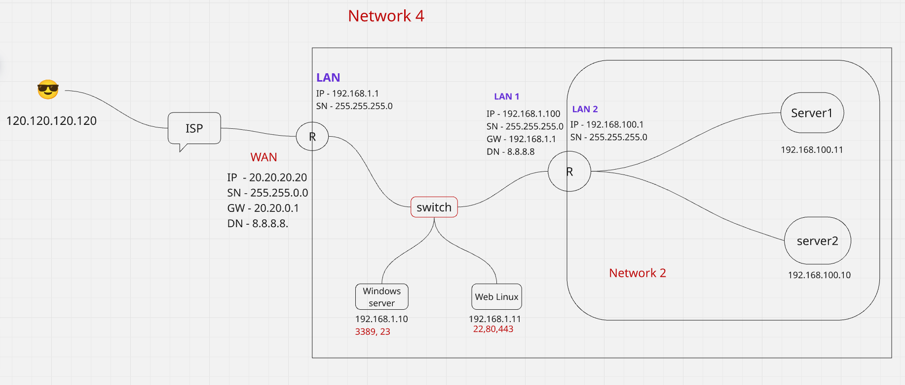
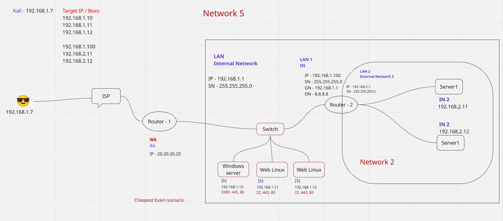

# <span style="color:red">Tunneling aur Port Forwarding</span>

## Problem Statement

Maan lo:
- **`Internal network`** ke andar kuch services chal rahi hain  
  (jaise: Web App, Database, Dashboard)
- Hum us network ke **bahar (internet se)** hain
- Hume un internal services ko access karna hai

👉 Yeh kaam **Tunneling** ya **Port Forwarding** dono se possible hai.

---

## 1. Tunneling kya hota hai?

Tunneling ka matlab hota hai:
**Internal network tak ek secure aur encrypted path banana**,  
jisse hum bahar hote hue bhi andar ki services access kar sakein.

### Kaise kaam karta hai?
- Client aur internal network ke beech ek **secure tunnel** banta hai
- Data encrypt hoke travel karta hai
- Aisa lagta hai jaise hum directly internal network ke andar ho

### Common Tunneling Examples
- VPN (Office VPN)
- SSH Tunneling

### Example (SSH Tunnel)
```
ssh -L 9000:192.168.1.50:8080 user@public-ip
```

Browser mein:
```
[http://localhost:9000](http://localhost:9000)
```

➡️ Yeh request tunnel ke through internal service
`192.168.1.50:8080` tak pahunch jaati hai.

### Tunneling ke faayde
- High security (Encrypted)
- Internal services public nahi hoti
- Best for office / production environments

---

## 2. Port Forwarding kya hota hai?

Port Forwarding ka matlab hota hai:
**Router ko batana ki kaunsa external port kis internal IP aur port pe forward hoga.**

### Kaise kaam karta hai?
- Router ek rule bana leta hai
- Bahar se aane wali request directly internal service ko bhej di jaati hai

### Example
Router configuration:
```
PublicIP:8080 → 192.168.1.50:8080
```

Ab bahar se access:
```
[http://PublicIP:8080](http://PublicIP:8080)
```

➡️ Yeh request directly internal service ko hit karti hai.

### Port Forwarding ke faayde
- Setup simple hota hai
- Direct access milta hai

### Risk
- Service internet pe expose ho jaati hai
- Security ka risk hota hai agar firewall/authentication na ho

---

## 3. Tunneling vs Port Forwarding

| Feature | Tunneling | Port Forwarding |
|------|---------|----------------|
| Security | High (Encrypted) | Low–Medium |
| Network access | Pura internal | Sirf specific port |
| Internet exposure | ❌ No | ✅ Yes |
| Best use | Office / Internal tools | CCTV, Game server |

---

## 4. Conclusion

- Agar **secure tarike se internal services access karni ho**  
  → **Tunneling use karo**
- Agar **sirf ek service ko internet se access karna ho**  
  → **Port Forwarding use ho sakta hai (with care)**

### One-line yaad rakhne ke liye:
- **Tunneling** = Secure raasta bana ke andar jaana  
- **Port Forwarding** = Ek darwaza bahar ke liye khol dena

---

## 📊 ASCII Diagram 

```md
## Tunneling Diagram (SSH / VPN)

[ Your Laptop ]
      |
      |  (Encrypted Tunnel)
      |====================>
      |
[ Public Server / VPN ]
      |
      |  Internal Network
      v
[ 192.168.1.50:8080 ]
(Internal Web / DB / Service)
```

```md
## Port Forwarding Diagram

Internet User
      |
      v
[ Public IP : 8080 ]
      |
      |  (Port Forwarding Rule)
      v
[ Router ]
      |
      v
[ 192.168.1.50 : 8080 ]
(Internal Service)
```

---

# Tunneling vs Port Forwarding – 

## Tunneling
- Secure aur encrypted connection hota hai
- External user ko internal network ka access milta hai
- Internal services internet pe expose nahi hoti
- Common tools:
  - VPN
  - SSH Tunnel

### Example:
External laptop → SSH/VPN → Internal service (192.168.x.x)

### Use cases:
- Office internal apps
- Database access
- Secure admin panels

---

## Port Forwarding
- Router specific port ko internal IP par forward karta hai
- Internal service internet pe directly expose hoti hai
- Security risk hota hai agar proper firewall/auth na ho

### Example:
PublicIP:8080 → Router → 192.168.1.50:8080

### Use cases:
- CCTV cameras
- Game servers
- Simple home web servers

---

## Key Difference (One Line)
- Tunneling = Secure tunnel bana ke network ke andar jaana
- Port Forwarding = Ek port ka darwaza internet ke liye khol dena


---

## 🧠 Interview mein bolne ke liye killer line 😎

> “Tunneling secure remote access provide karta hai bina services ko public expose kiye,

> jabki port forwarding specific internal service ko internet pe expose karta hai.”


---


### Example of Internal Network below Diagram:



### Example of Tunneling below Diagram:





### Example of Cheapest exam scenario :


---

# <span style="color:blue">Tunneling aur Port Forwarding</span>

Tunneling and Port Forwarding are networking techniques widely used in **system administration, DevOps, and cybersecurity** to securely access internal services, bypass network restrictions, and control traffic flow.

---

## Tunneling

Tunneling is the process of **encapsulating one network protocol inside another** to securely transmit data across an untrusted network such as the internet.

### Key Characteristics

- Creates a secure communication channel  
- Encrypts transmitted data  
- Enables remote access to internal or restricted resources  

### Common Examples

- SSH Tunneling  
- VPNs (IPsec, OpenVPN, WireGuard)  
- HTTPS (TLS over TCP)  

---

## Example: SSH Tunnel

Access an internal database through a bastion host:

```bash
ssh -L 3306:internal-db:3306 user@bastion-host
````

This forwards **local port 3306** to **internal-db:3306** through a secure SSH tunnel.

