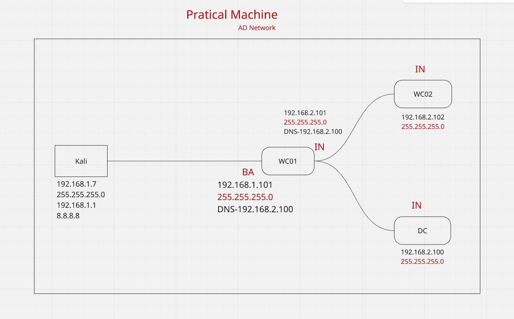
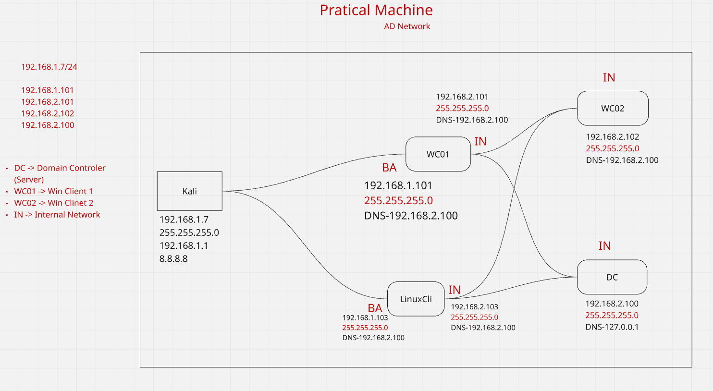
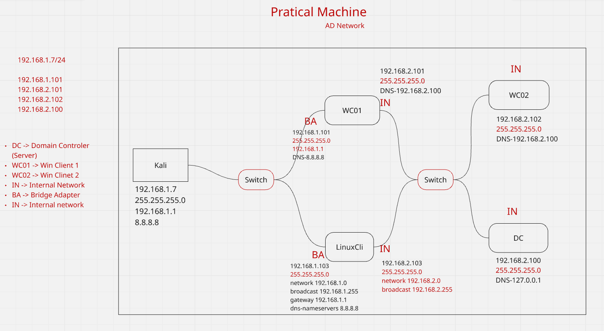
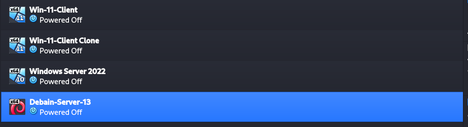
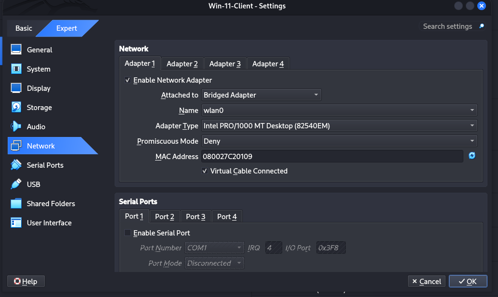

# Lab Setup for Tunneling and Port Forwarding

- This lab demonstrates **Tunneling and Port Forwarding** using multiple machines in Internal Network.Below Diagram to understand how it Works.

### Basic Seconario




### We are configure Real life scenario



---

First go To Virtual machine 

Install All Machine : Adapter Configuration
1. Win-11-Clinet (Dual Adapter)
2. Debain-Server-13 (Dual Adapter)
3. Win-11-Client clone (Single Adapter)
4. Windows Server 2022 (Single Adapter)

Go to VM setting > Network Setting and Adapter1 > Attached to Bridged Adapter , Adapter2 > Attached to Internal Network

OK






---

## IP Address Configuration

### 1. Windows Client Machine (Dual Adapter)

#### Adapter 1 (External Network)
- IP Address: `192.168.1.101`
- Subnet Mask: `255.255.255.0`
- DNS Server: `8.8.8.8`

#### Adapter 2 (Internal Network)
- IP Address: `192.168.2.101`
- Subnet Mask: `255.255.255.0`
- DNS Server: `192.168.2.100`

---


### 2. Linux Machine (Dual Adapter)

#### Adapter 1 (External Network)
- IP Address: `192.168.1.103`
- Subnet Mask: `255.255.255.0`
- DNS Server: `8.8.8.8`

#### Adapter 2 (Internal Network)
- IP Address: `192.168.2.103`
- Subnet Mask: `255.255.255.0`
- DNS Server: `192.168.2.100`

```bash 
vim /etc/network/interfaces 
```
```bash
# This file describes the network interfaces available on your system
# and how to activate them. For more information, see interfaces(5).

source /etc/network/interfaces.d/*

# The loopback network interface
auto lo
iface lo inet loopback

# The primary network interface
allow-hotplug enp0s3
#iface enp0s3 inet dhcp
iface enp0s3 inet static
    address 192.168.1.103
    netmask 255.255.255.0
    network 192.168.1.0
    broadcast 192.168.1.255
    gateway 192.168.1.1
    dns-nameservers 8.8.8.8

# This is an autoconfigured IPv6 interface
iface enp0s3 inet6 auto


# The Secondary network interface
allow-hotplug enp0s8
#iface enp0s8 inet dhcp

iface enp0s8 inet static
	address 192.168.2.103
	netmask 255.255.255.0
	network 192.168.2.0
	broadcast 192.168.2.255

iface enp0s8 inet6 auto
```
---

### 3. Windows Server (Internal Network)

- IP Address: `192.168.2.100`
- Subnet Mask: `255.255.255.0`
- DNS Server: `127.0.0.1` (Localhost)

---

### 4. Windows Client (Internal Network)

- IP Address: `192.168.2.102`
- Subnet Mask: `255.255.255.0`
- DNS Server: `192.168.2.100`

---

## Purpose of This Lab

- Understand **network segmentation**
- Practice **SSH tunneling**
- Demonstrate **port forwarding**
- Learn **pivoting using dual-homed systems**
- Simulate real-world **internal network access via tunneling**

---

## Notes

- Dual-adapter machines bridge communication between external and internal networks.
- Windows Server acts as the **internal resource**.
- Attacker machine (Kali Linux) is used to perform tunneling and port forwarding attacks.

---

## scenario ya hai ki :

kali can't connect : 192.168.2.101 , 192.168.2.103 , 192.168.2.103 , 192.168.2.100

Check the connect using `ping` and `Nmap` command. 

```bash
ping IP-Address
nmap -v IP-address
```

But Internal device are connect to each other.

So , i want to access the internal service so how to do?