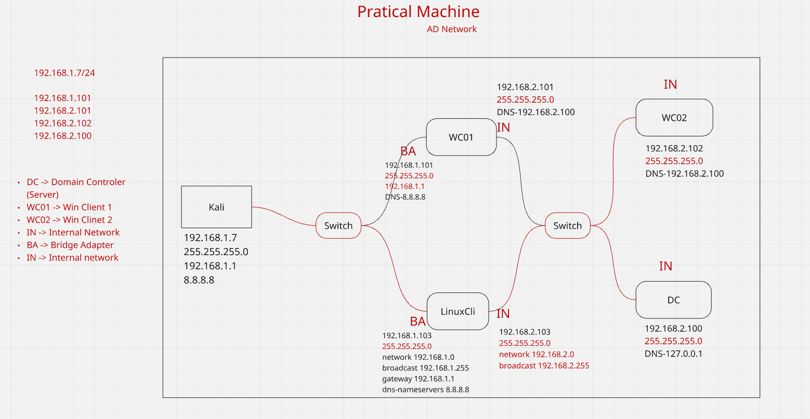
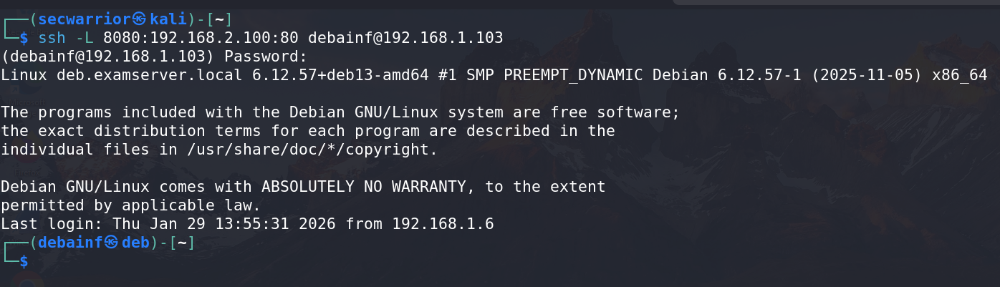
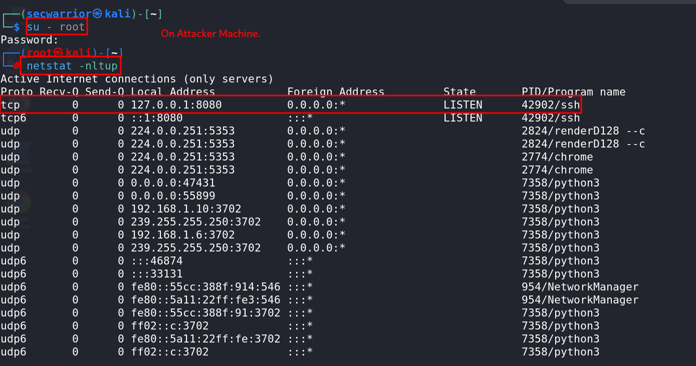
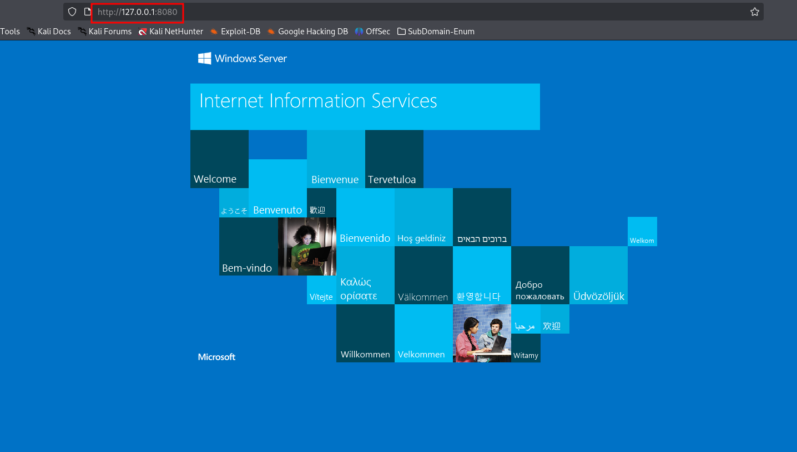

## In Exam scenario

First we check IP Address of Linux or we give a machine and In my Machine IP Check to normal user 
```bash
ip a
```
- enp0s3: inet 192.168.1.103/24 brd 192.168.1.255 scope global enp0s3
- enp0s8: inet 192.168.2.103/24 brd 192.168.2.255 scope global enp0s8


Now check `nmap` if not you can install `root user`
```bash
apt install nmap
``` 
Now check how many Host are available in `internal Network`
```bash
nmap -v 192.168.2.0/24
```
scan result show host up:

```bash
Nmap scan report for 192.168.2.100
Host is up (0.00017s latency).
Not shown: 988 closed tcp ports (conn-refused)
PORT     STATE SERVICE
53/tcp   open  domain
80/tcp   open  http
88/tcp   open  kerberos-sec
135/tcp  open  msrpc
389/tcp  open  ldap
445/tcp  open  microsoft-ds
464/tcp  open  kpasswd5
593/tcp  open  http-rpc-epmap
636/tcp  open  ldapssl
3268/tcp open  globalcatLDAP
3269/tcp open  globalcatLDAPssl
5985/tcp open  wsman

Nmap scan report for 192.168.2.102
Host is up (0.00022s latency).
Not shown: 996 closed tcp ports (conn-refused)
PORT     STATE SERVICE
135/tcp  open  msrpc
139/tcp  open  netbios-ssn
445/tcp  open  microsoft-ds
3389/tcp open  ms-wbt-server

Nmap scan report for 192.168.2.103
Host is up (0.000065s latency).
Not shown: 993 closed tcp ports (conn-refused)
PORT     STATE SERVICE
21/tcp   open  ftp
22/tcp   open  ssh
53/tcp   open  domain
80/tcp   open  http
389/tcp  open  ldap
443/tcp  open  https
8080/tcp open  http-proxy

Read data files from: /usr/bin/../share/nmap
Nmap done: 256 IP addresses (3 hosts up) scanned in 14.51 seconds
```
Now Scan the Host of IP : `192.168.2.100`
```bash
nmap -v -sT -sV -sC -p- 192.168.2.100
```


---

# SSH-Tunneling

## SSH Tunneling (SSH Port Forwarding)

**SSH Tunneling**, also known as **SSH Port Forwarding**, is a technique that allows secure transmission of network traffic by encapsulating it inside an encrypted SSH connection. It is extensively used in **system administration, penetration testing, red teaming, and secure remote access**.

---

## Why SSH Tunneling Is Important

- Encrypts otherwise plaintext protocols (HTTP, FTP, MySQL, etc.)
- Enables access to internal or restricted services
- Bypasses firewall and network restrictions
- Assists in lateral movement and pivoting
- Works reliably over untrusted networks

---

## How SSH Tunneling Works

SSH tunneling forwards traffic from a local or remote port through an SSH connection to a destination host and port.  
The SSH server acts as a **secure intermediary**, ensuring **confidentiality and integrity** of the data.

---

## Types of SSH Tunneling

SSH provides **three primary port forwarding modes**:

- **Local Port Forwarding**
- **Remote Port Forwarding**
- **Dynamic Port Forwarding (SOCKS Proxy)**

---
## 1. SSH Local Port Forwarding

SSH Local Port Forwarding forwards traffic from a **local port** to a **remote destination** through an SSH server.

- Forwards traffic from a local port to a remote destination through an SSH server  
- Commonly used to access services that are only reachable from the SSH server’s network  

---

## Common Use Cases

* Accessing internal web applications
* Secure database access (MySQL, PostgreSQL)
* Bypassing IP-based access restrictions

---

## Traffic Flow

```text
Local Host → SSH Server → Target Service
```

## SSH Local Port Forwarding – Traffic Flow Diagram

```text
+-------------------------+        SSH Tunnel        +-------------------------+
|        Attacker         | ----------------------> |        SSH Server        |
|      (Kali Linux)       |                          |       (Pivot Host)      |
|     192.168.1.7         |                          |     192.168.1.103       |
|     localhost:8080      |                          |                         |
+-------------------------+                          +-----------+-------------+
                                                                      |
                                                                      | Forwarded Traffic
                                                                      v
                                                         +-------------------------+
                                                         |    Internal Service     |
                                                         |   192.168.2.100:80      |
                                                         +-------------------------+
````

---

## Explanation

* The **Attacker (Kali Linux)** accesses the service via `localhost:8080`
* Traffic is sent through an **SSH Tunnel**
* The **SSH Server (Pivot Host)** forwards the traffic
* The request finally reaches the **Internal Service (192.168.2.100:80)**

---


## Syntax

```bash
ssh -L [LOCAL_PORT]:[DESTINATION_HOST]:[DESTINATION_PORT] user@ssh_server
```

### Example 1

```bash
ssh -L 8080:192.168.1.100:80 user@remote_host
```

## Lab Scenario

- Network Layout 

  - Attacker (kali) : 192.168.1.7

  - SSH Pivot / Target : 192.168.1.103

  - Internal Web Server : 192.168.2.100:80


### Example 2 (Lab Scenario)

```bash
ssh -L 8080:192.168.2.100:80 debainf@192.168.1.103
```
On kali Linux (atacker machine) do not close/exit terminal


Open New Tab



---

## Explanation

* Visit: `http://localhost:8080`



* Traffic is securely forwarded to `192.168.1.100:80` via `remote_host`
* In the lab example, traffic is forwarded to the **internal server (192.168.2.100:80)** through the **pivot host (192.168.1.103)**
 
---

## Using `-N` (No Remote Shell)

```bash
ssh -N -L 8080:192.168.2.100:80 debain@192.168.1.103
```

Result Service `192.168.2.11:80` becomes available on:

```url
http://localhost:8080
```

### Why `-N`?

* No interactive shell
* Used `only for tunneling`
* Cleaner and safer during port forwarding

---

## Binding to a Specific Local IP

```bash
ssh -N -L 192.168.1.7:80:192.168.2.100:80 debain@192.168.1.103
```

### Explanation

* Tunnel binds to local IP `192.168.1.7` instead of `127.0.0.1`
* Useful when other hosts need access to the forwarded service

---

## Forwarding Local Port 80 to Internal Services

```bash
ssh -N -L 80:127.0.0.1:80 debainf@192.168.1.103
```

```bash
ssh -N -L 192.168.1.10:80:192.168.2.100:80 debainf@192.168.1.103
```

```bash
ssh -N -L 8080:192.168.2.100:8080 debainf@192.168.1.103
```

## Note

* Ports below `1024` require **root privileges**
* Use `sudo` if needed

```bash
sudo ssh -N -L 80:192.168.2.2:80 armour@192.168.1.71
```

---

## Key Points

* **LOCAL_PORT** → Port on attacker machine
* **DESTINATION_HOST:DESTINATION_PORT** → Internal service
* **SSH_SERVER** → Pivot host with access to internal network
* **-N** : No shell, tunneling only
* Traffic is encrypted end-to-end.


---


