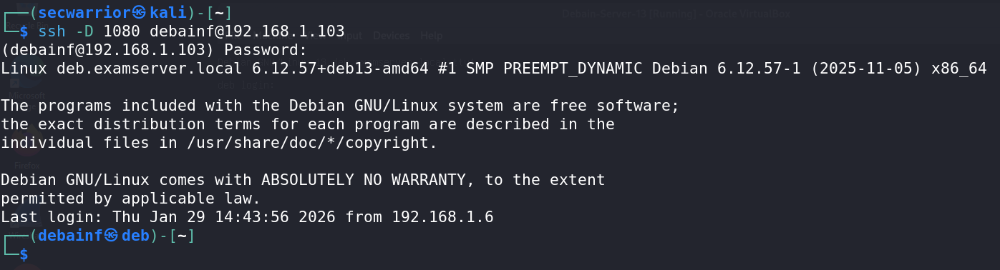
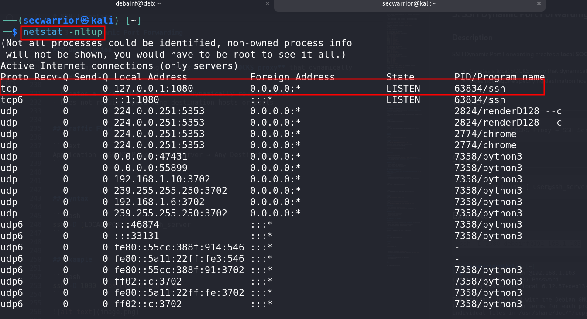
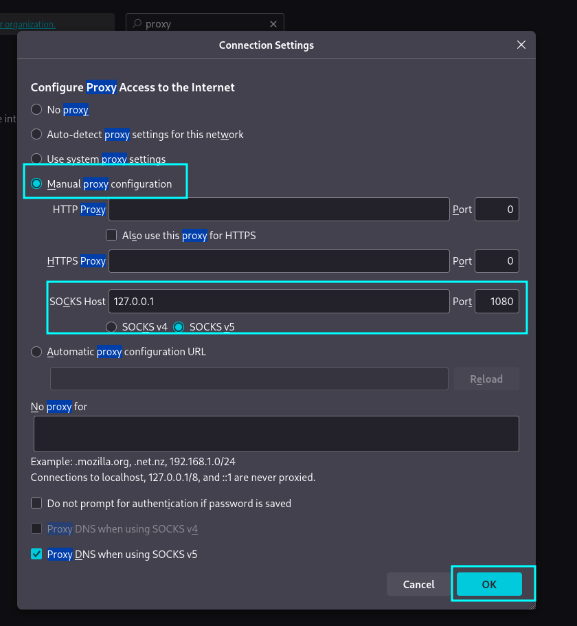
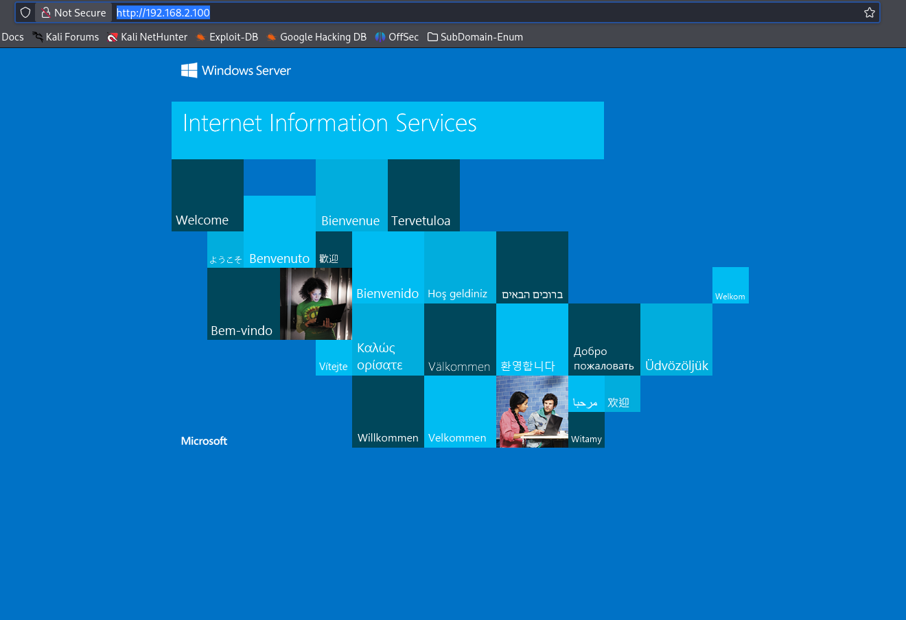
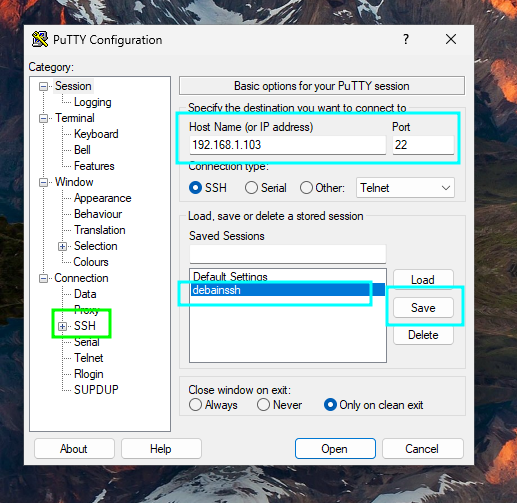
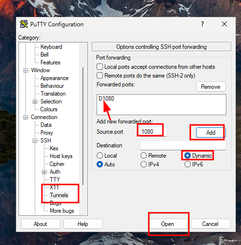
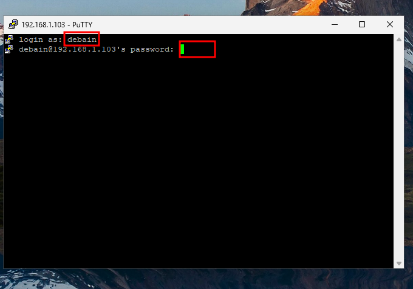
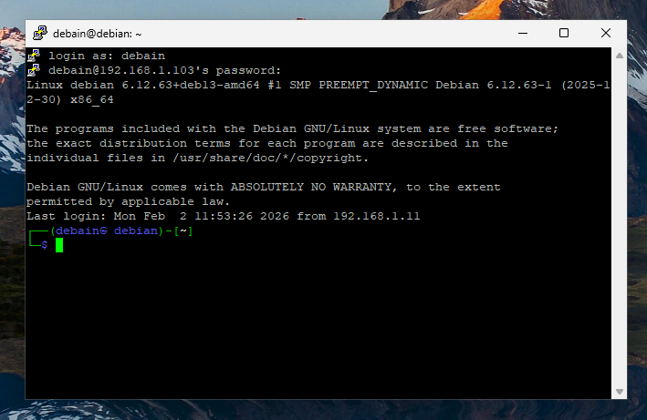

# SSH Dynamic Port Forwarding

SSH Dynamic Port Forwarding creates a **SOCKS proxy** that dynamically routes traffic through an SSH server.


## Key Features

- Creates a **SOCKS4 / SOCKS5** proxy  
- Allows **dynamic routing** of traffic  
- Commonly used for:
  - Anonymized browsing
  - Bypassing firewalls and network restrictions
  - Pivoting during penetration testing


## Traffic Flow

```text
Application → SOCKS Proxy → SSH Server → Any Destination
```


## Syntax

```bash
ssh -D [LOCAL_PORT] user@ssh_server
``` 


## Basic Example

```bash
ssh -D 1080 debainf@192.168.1.103
```





## Explanation

* A SOCKS proxy is created at `localhost:1080`
* Applications configured to use this proxy send traffic via `remote_host`


## Lab Scenario

### Network Layout

* **Attacker (Kali / SSH Client):** `192.168.1.7`
* **Target (SSH Server):** `192.168.1.103`
* **Attacker's Web Server:** `192.168.2.100:80`

---

## Command Used

```bash
ssh -N -D 127.0.0.1:1080 armour@192.168.1.103
```

* `-N` → Do not execute remote commands (tunnel only)
* `-D 127.0.0.1:1080` → Bind SOCKS proxy to local address and port
* `armour@192.168.1.25` → SSH user and target host

---

## Generic Syntax (Detailed)

```bash
ssh -N -D <bind_address>:<bind_port> <username>@<ssh_server>
```

---

## Additional Example

```bash
ssh -N -D 127.0.0.1:1080 root@192.168.1.103
```



http://192.168.2.100/


---

## Once the SSH Connection Is Established

* A SOCKS proxy runs locally on `127.0.0.1:1080`
* Applications configured to use this proxy will have their traffic:

  * Encrypted
  * Forwarded through the SSH server
  * Routed dynamically to any destination


---

Check other `external network` Like windows clinet PC 

Network Connect Bridge adapter:

# SSH Dynamic Port Forwarding in `Windows` (PuTTY)

SSH Dynamic Port Forwarding on Windows can be configured using **PuTTY** to create a **SOCKS proxy** for dynamically routing traffic through an SSH server.


## Step-by-Step Configuration

1. Download and install **PuTTY** on your Windows machine.

    https://www.chiark.greenend.org.uk/~sgtatham/putty/latest.html

2. Launch **PuTTY** and open the **Session** screen.

3. Enter the following SSH connection details:
   - **Host Name (or IP address)**
   - **Port:** `22` (default)
   - **Connection type:** `SSH`




4. In the left panel, navigate to:


    Connection → SSH → Tunnels

5. Configure the SOCKS proxy:
- **Source port:** `1080` (or any unused port)
- Select the **Dynamic** radio button
- Click **Add**

 

 

6. (Optional) To reuse the configuration:
- Go back to the **Session** screen
- Enter a name under **Saved Sessions**
- Click **Save**


7. Click **Open** to establish the SSH connection.
8. When prompted, enter your **SSH username and password**.




http://192.168.2.100/

---

## Result

Once the SSH session is established:

- A **SOCKS proxy** will be created on the local machine
- The proxy listens on:

```
127.0.0.1:1080
```

- Applications configured to use this SOCKS proxy will have their traffic securely routed through the SSH server

