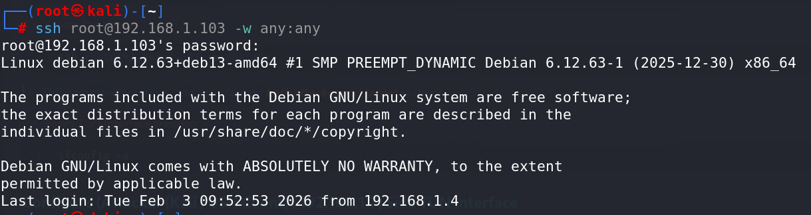
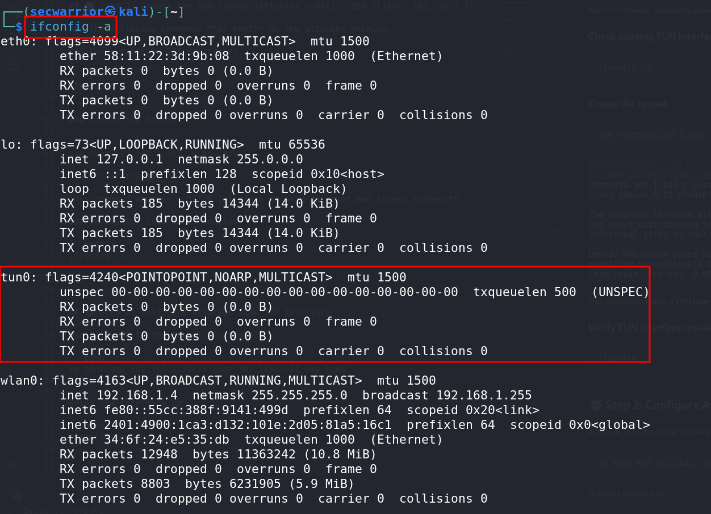

# 🔐 VPN-Tunnel-Using-SSH-Server (TUN/TAP)

## 🌐 VPN Tunnel Using SSH Server (TUN/TAP)

* This setup demonstrates how to create a **VPN-like tunnel using SSH** with **TUN interfaces**.
* **Root access** is required on **both attacker and target systems**, and SSH must allow tunneling.

---

## 📋 Prerequisites

* Root access on **both systems**
* SSH server must allow:

  * Root login
  * Tunnel interfaces

---
## Lab Scenario

### Network Layout

* **Attacker (Kali / SSH Client):** `192.168.1.7`
* **Target (SSH Server):** `192.168.1.103`
* **Attacker's Web Server:** `192.168.1.1:80`


## ⚙️ SSH Server Configuration - Target(SSH Server): 192.168.1.103

Edit the SSH daemon configuration file:

```bash
vim /etc/ssh/sshd_config
```

Ensure the following options are enabled:

```text
PermitRootLogin yes
PermitTunnel yes
```

Restart the SSH service:

```bash
systemctl restart ssh
```

---

## 🧭 Step 1: Create the SSH Tunnel (Attacker – Kali / SSH Client: 192.168.1.7)

Run the following commands **as root** on the attacker machine.

### Check existing TUN interfaces

```bash
ifconfig -a
```

### Create the tunnel

```bash
ssh root@192.168.1.103 -w any:any
```


This command creates a **TUN interface on both attacker and target systems**.

### Verify TUN interface creation

```bash
ifconfig -a
```

---

## ⚙️ Step 2: Configure Attacker Side TUN Interface (Attacker – Kali / SSH Client: 192.168.1.7)

Assign an IP to the tunnel interface:

```bash
ip addr add 192.168.2.50/24 peer 192.168.2.11 dev tun0
```

Bring the interface up:

```bash
ifconfig tun0 up
```

### Check existing TUN interfaces

```bash
ifconfig -a
```


---

## 🎯 Step 3: Configure Target (SSH Server) – 192.168.1.103 Side TUN Interface

On the **target machine**, verify the TUN interface:

```bash
ifconfig -a
```

Assign an IP to the tunnel interface:

```bash
ip addr add 192.168.2.51/24 peer 192.168.2.50 dev tun0
```

Bring the interface up:

```bash
ifconfig tun0 up
```

---

## 🔁 Step 4: Enable IP Forwarding on Target (SSH Server): 192.168.1.103

Allow the target to forward packets:

```bash
echo 1 > /proc/sys/net/ipv4/ip_forward
```

(Optional permanent setting):

```bash
sysctl -w net.ipv4.ip_forward=1
```

---

## 🌐 Configure NAT on Target (SSH Server): 192.168.1.103

Masquerade traffic from the tunnel to the internal network:

If `iptables` not install use this command `    `

```bash
iptables -t nat -A POSTROUTING -s 192.168.2.50 -o enp0s8 -j MASQUERADE
```

check
```bash
iptables -t nat -L POSTROUTING -n -v --line-number
```
---

## 🧭 Step 5: Add Route on Attacker (Kali / SSH Client): 192.168.1.7

Route internal network traffic through the tunnel:

```bash
route add -net 192.168.2.0/24 gw 192.168.2.103
```

check
```bash
ip route
```
---

## ✅ Result

* A `VPN-style tunnel` is established over SSH
* Attacker can access the **target’s internal network (192.168.2.0/24)**
* Useful for:

  * Network pivoting
  * Post-exploitation lateral movement
  * Bypassing firewall restrictions

---


## 🧹 ROLLBACK / CLEANUP SECTION

## ⛔ Stop SSH Tunnel

On attacker machine:

```text
Ctrl + C
```

---

## 🔽 1. Bring Down Tunnel Interfaces

### Attacker

```bash
ip link set tun0 down
```

### Target

```bash
ip link set tun0 down
```

---

## 🗑️ 2. Remove Tunnel IP Addresses

### Attacker

```bash
ip addr del 192.168.2.50/24 dev tun0
```

### Target

```bash
ip addr del 192.168.2.51/24 dev tun0
```

---

## 🛣️ 3. Remove Route (Attacker)

```bash
ip route del 192.168.2.0/24 via 192.168.2.51
```

Verify:

```bash
ip route
```

---

## 🚫 4. Disable IP Forwarding (Target)

### Temporary

```bash
echo 0 > /proc/sys/net/ipv4/ip_forward
```

### Persistent

```bash
sysctl -w net.ipv4.ip_forward=0
```

Verify:

```bash
cat /proc/sys/net/ipv4/ip_forward
```

Expected output:

```text
0
```

---

## 🧯 5. Remove NAT Rule (Target)

### Delete by Exact Rule

```bash
iptables -t nat -D POSTROUTING -s 192.168.2.50 -o enp0s8 -j MASQUERADE
```

---

### Delete by Rule Number

List rules with numbers:

```bash
iptables -t nat -L POSTROUTING -n -v --line-numbers
```

Delete the rule:

```bash
iptables -t nat -D POSTROUTING <RULE_NUMBER>
```

---

## ✅ Verify Cleanup

Check tunnel interfaces:

```bash
ip link show | grep tun
```

Expected result:

```text
(no output)
```

Check NAT table:

```bash
iptables -t nat -L POSTROUTING -n -v
```

---

## 🔐 18. Restore SSH Hardening (Recommended)

Edit SSH configuration:

```bash
vim /etc/ssh/sshd_config
```

Revert settings:

```text
PermitRootLogin no
PermitTunnel no
```

Restart SSH:

```bash
systemctl restart ssh
```

---


